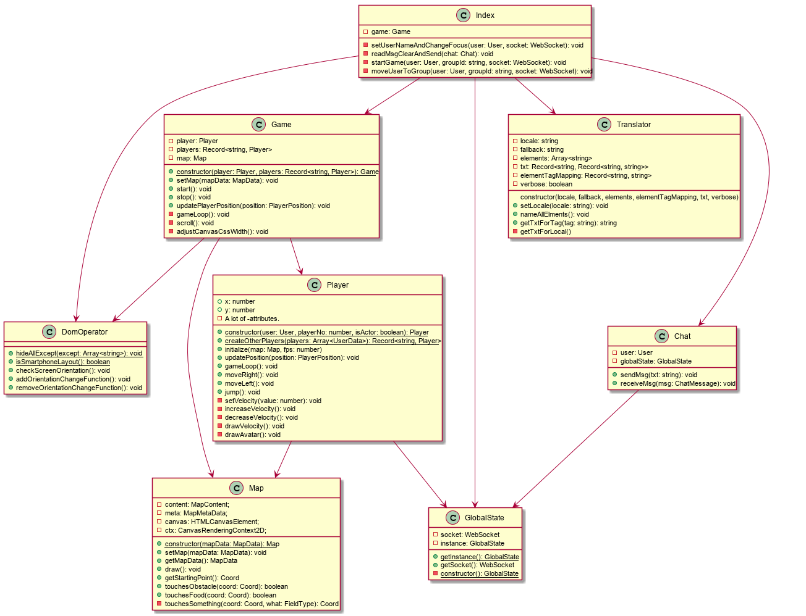

# 2D multiplayer jump and run game
**Content**
* [Short description](#short-description)
* [Installation](#installation)
* [Classes (static)](#classes-static)
* [Class interactions (dynamic)](#class-interactions-dynamic)
* [Technical details](#technical-details)
* [Room for improvement](#room-for-improvement)
* [Image credits](#image-credits)

## Short description
This is a multiplayer 2D jump an run game (for up to 4 players per game and up to 3 games in parallel).

The goal is to be the fastest over all of the 5 levels (5-Seen-Wanderung, Pizol, Switzerland). You have to stay on track and jump over obstackles in order not to lose velocity. If you lose velocity, you can regain speed by picking up food.

On the smartphone, the app is played using 3 buttons on the screen (left, right, jump). On the computer, a keyboard can be used (left arrow, right arrow, space to jump). 

<table>
<tr>
<td></img></td>
<td></img></td>
</tr>
<tr>
<td>Screenshot of lobby on computer screen</td>
<td>Screenshot of gameplay on smartphone</td>
</tr>
</table>

I programmed this game for the BSc module "Web Engineering" (5 ECTS) at FFHS (Fernfachhochschule Schweiz) in 2020.
 
## Installation
For front-end (client) und back-end (server)  
* If npm is not yet installed...  
  * Download and install npm  
  https://www.npmjs.com/get-npm
* If Python is not yet installed...  
  * Download Python (Version 2.x or 3.x)  
  https://www.python.org/downloads/
  * Install globally (for all users). Add python to the PATH environment variable.
* If you use Windows and Visual Studio is not yet installed...  
  * Download the Visual Studio Installer  
  https://visualstudio.microsoft.com/de/downloads/  
  * Install the following:
  "Desktop development with C++" (required for the node module "better-sqlite3")
* Clone the source code and navigate into the source code directory.
* `npm install --global http-server`

For front-end (client)  
* Open `./front-end/src/config/config.ts` and add IP and port of the back-end (for websocket connection).
* Navigate to `./front-end` and open shell.
  * `npm install`
  * `npm run pipeline-prod`
* Variant A – open local website on your PC:  
  `./front-end/build/index.html`
* Variante B – start web server:  
  * `cd ./font-end`
  * `http-server build`  
    (Does not work in PowerShell)
  * Then, open the IP that is shown in the console in your web browser.

For back-end (server)  
* Open `./back-end/src/config/config.ts` and add port of back-end (websocket).  
* Navigate to `./back-end` and open shell.  
  * `npm install`
  * `npm run pipeline-prod`
  * `npm run start-server`

For browser compatibility reasons, the [npm](https://github.com/npm) pipeline will transiple the front-end/client code from Typescript to Javascript (ES2017). The multi-step pipeline uses [Typescript](https://github.com/microsoft/TypeScript) and [babel](https://github.com/babel/babel) for transpilation and [webpack](https://github.com/webpack) to bundle all necessary resources for the app.  

<table>
<tr>
<td></img></td>
<td></img></td>
</tr>
<tr>
<td>Build process and distribution</td>
<td>Transpilation and packaging of resources</td>
</tr>
</table>

## Classes (static)
<table>
<tr><td></img></td></tr>
<tr><td>Legend for class diagrams</td></tr>
</table>

<table>
<tr><td></img></td></tr>
<tr><td>Classes of the client (front-end)</td></tr>
</table>

<table>
<tr><td></img></td></tr>
<tr><td>Classes of the server (back-end)</td></tr>
</table>

## Class interactions (dynamic)
<table>
<tr><td></img></td></tr>
<tr><td>Sequence diagram of client server interaction.</td></tr>
</table>

<table>
<tr><td></img></td></tr>
<tr><td>Sequence diagram interaction between Game, Map and Player classes (in client/front-end).</td></tr>
</table>

<table>
<tr><td></img></td></tr>
<tr><td>Client-server process interaction (PowerPoint slide in German).</td></tr>
</table>

<table>
<tr><td></img></td></tr>
<tr><td>Interaction between Game, Map and Player classes (client and server; PowerPoint slide in German).</td></tr>
</table>

<table>
<tr><td></img></td></tr>
<tr><td>Interaction between Game, Map and Player classes (in client/front-end; PowerPoint slide in German).</td></tr>
</table>

## Technical details
* This project has very few dependencies (jQuery, lodash, sqlite3, better-sqlite3, ws). I programmed almost everything from scratch.
* The maps in the 5 different levels (with different degrees of difficulties) are created randomly by the class "MapCreator" in the server/back-end part of the project. Therefore, whenever you play the game, you will never see a map twice. The difficulties of a level can be parameterized (programatically, not by the end user) by a) the length of the trail, b) the width of the trail, c) the frequency of changes in the direction of the trail, d) the frequency of stones/animals (obstacles) on the trail, e) the frequency of food on the trail.
* The canvas has 3 layers:
  * Top: Avatar of own player.
  * Middle: Avatar of all other players
  * Bottom: The map (grass, trail, obstacles, food).
* `map.draw()`  
  When drawing the canvas, each category of image will be loaded and then be drawn everywhere on the map where it belongs to. Otherwise, all images have to be loaded countless times which is very inefficient. Also, because loading the image is asynchronous, it could not be guaranteed that stones are on top of the grass, because the stone could be loaded before the grass and therefore be painted under the grass.
  ```es2017
  for (image ...) {
    // Load image (e.g., STONE)
	// Now, loop through all fields of map and check if stone should be drawn.
    for (let y = 0; y < map.length; y++) {
      for (let x = 0; x < map[y].length; x++) {
        if (map[y][x] == “STONE”) {
          // Draw image.
        }
      }
    }
  }
  ```
* `game.scroll()`  
  The canvas is always scrolled such that 2/3 of the fields are in front of the avatar.
<table style="border: none;">
<tr><td></img></td></tr>
<tr><td>game.scroll() - Illustration of the effect.</td></tr>
</table>
* `game.adjustCanvasWidth()`  
  The canvas is always drawn such that the player sees exactly 30 vertical fields of the map.
<table style="border: none;">
<tr><td></img></td></tr>
<tr><td>game.adjustCanvasWidth() - Illustration of the effect.</td></tr>
</table>
  
## Room for improvement
* All data sent via the socket connection (enumerations) should be changed to integer values instead of strings to save bandwidth.
* In the current version, if a player takes food, the disapearence of the food on the map is not communicated to other players. Therefore, one single banana on the trail can be eaten by all players.

## Image credits
Background image depicting the "Wildsee" - by Nicola Bonderer  
